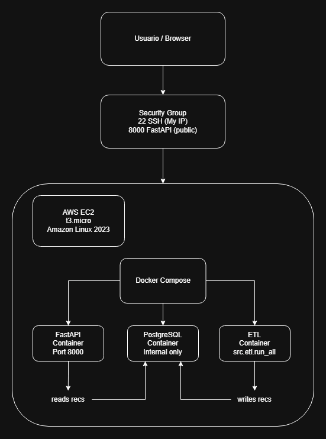
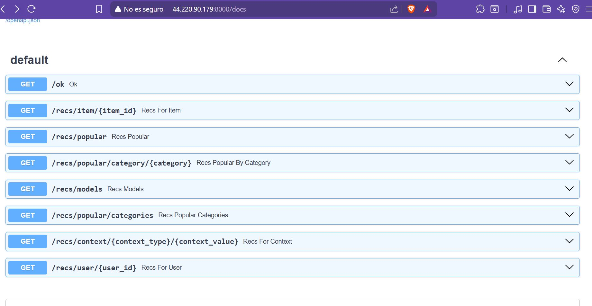
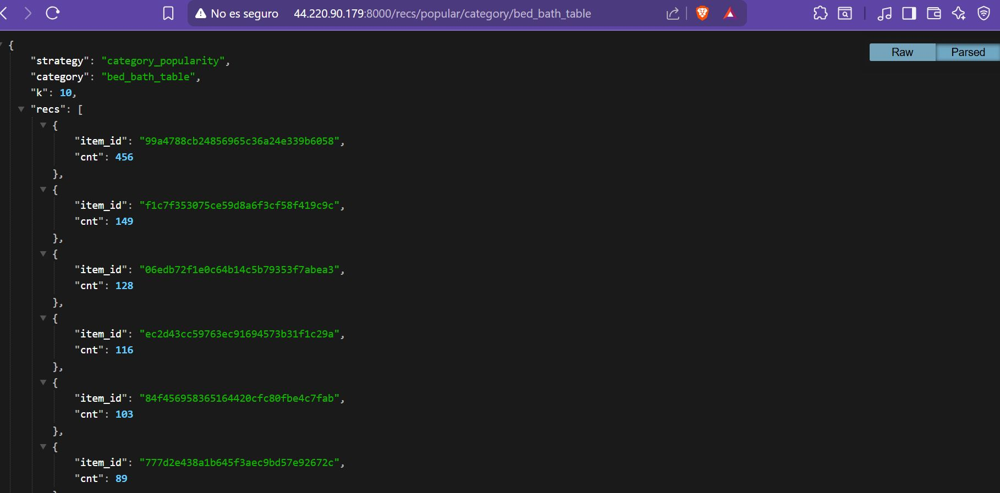

# Olist DS — Recommender Systems, NLP, and API Serving

End-to-end Data Science / ML project built on the **Olist Brazilian E-Commerce Dataset** (Kaggle), with 3 main modules:

1. **NLP + classification** for bad review detection and complaint analysis  
2. **Recommender systems** for cold-start and warm-start scenarios  
3. **Production-oriented serving** with **PostgreSQL, Docker Compose, FastAPI, and AWS EC2**

---

## What it solves

- **Detect bad customer experiences automatically** from Portuguese reviews to support QA / customer support prioritization.
- **Recommend products** using different strategies depending on user context:
  - **cold-start** → popularity/context-based recommendations
  - **warm-start** → collaborative / item-item / hybrid logic

---

## Architecture



### Deployment summary
- **AWS EC2** (`t3.micro`, Amazon Linux 2023)
- **Docker Compose** orchestrating:
  - **FastAPI** container
  - **PostgreSQL** container
  - **ETL** container
- **FastAPI** exposed on port `8000`
- **PostgreSQL** kept internal to the Docker network
- **ETL** generates recommendations offline and stores them in PostgreSQL

### Runtime flow
- **User / Browser** → FastAPI (`/docs`, endpoints)
- **FastAPI** → reads data and recommendations from PostgreSQL
- **ETL** → writes recommendations to PostgreSQL

---

## AWS EC2 deployment

The project was deployed on **AWS EC2** using **Docker Compose**.

### Infrastructure

* **Instance type:** `t3.micro`
* **OS:** Amazon Linux 2023
* **Public API access:** port `8000`
* **SSH access:** port `22`
* **Internal database:** PostgreSQL only accessible inside the Docker network

### Prerequisites

* An EC2 instance running Amazon Linux 2023
* Docker installed and enabled
* The repository cloned into the instance
* Olist CSV files uploaded to `data/raw/`
* A valid `.env` file in the project root

### 1. Connect to the EC2 instance

```bash
ssh -i "your-key.pem" ec2-user@<PUBLIC_IP>
```

### 2. Clone the repository

```bash
git clone https://github.com/benitodev/Olist_NLP.git
cd Olist_NLP
```

### 3. Upload the dataset

Place the Olist CSV files inside:

```text
data/raw/
```

Example from a local machine:

```bash
scp -i "your-key.pem" -r data/raw ec2-user@<PUBLIC_IP>:~/Olist_NLP/data/
```

### 4. Create `.env`

Example:

```env
POSTGRES_DB=olist
POSTGRES_USER=postgres
POSTGRES_PASSWORD=olist123

DB_HOST=db
DB_PORT=5432
```

### 5. Build and start the services

```bash
docker compose build
docker compose up -d
docker compose --profile etl run --rm etl
```

### 6. Access the API docs

```text
http://<PUBLIC_IP>:8000/docs
```

### Notes

* `FastAPI` is exposed publicly on port `8000`
* `PostgreSQL` is not exposed publicly; it is only available inside the Docker network
* The ETL pipeline generates recommendations offline and stores them in PostgreSQL
* For local development, `docker-compose.dev.yml` can be used to expose PostgreSQL on `localhost:5432`

### Deployment evidence

Screenshots in `docs/images/`




---

## Dataset

**Source:** Olist Brazilian E-Commerce Public Dataset (Kaggle)  
https://www.kaggle.com/datasets/olistbr/brazilian-ecommerce

### Tables used
- Orders
- Customers
- Products
- Sellers
- Geolocation
- Reviews (Portuguese text)

---

## Module 1 — NLP: Bad Review Detection

### Target definition
- `bad_review = 1` if `review_score <= 2`
- `bad_review = 0` if `review_score > 2`

### High-level pipeline
- text cleaning and normalization
- lowercasing
- accent normalization
- Portuguese stopwords removal
- preservation of negations such as `não`
- TF-IDF word n-grams
- optional character n-grams for noisy text / typos

### Models evaluated
- Logistic Regression
- Linear SVM / calibrated variants

### Evaluation
- time-based split to avoid leakage
- ROC-AUC
- PR-AUC
- F1 / Precision / Recall for the minority class
- threshold tuning depending on business objective

### Example baseline results
- **ROC-AUC ≈ 0.95**
- **PR-AUC ≈ 0.82**
- **F1 (bad)** ≈ 0.83
- **Recall (bad)** ≈ 0.91

> Exact values may vary slightly depending on seeds, cutoffs, and filtering decisions.

---

## Module 2 — Recommender Systems

This dataset is highly **sparse** at the user–item level.  
With the time split used here, most users have only **one purchase** in train, which limits pure collaborative filtering.

### Why separate scenarios?
- **Cold-start** → no user history
- **Warm-start** → some user history available

### Cold-start recommendations

#### 1. Global popularity
Recommends the global Top-K items.

Example **HitRate@K**:
- K=10 → ~0.0119
- K=50 → ~0.0385
- K=80 → ~0.0600

#### 2. Category popularity
Simulates a category-page recommendation context.

Example **HitRate@K**:
- K=10 → ~0.1110
- K=20 → ~0.1676
- K=50 → ~0.2464

**Category popularity** generally outperforms global popularity in cold-start because it adds context.

### Warm-start recommendations

#### Collaborative filtering (ALS)
- built from the user-item matrix
- evaluated with time-based / leave-last-out style logic

Because the dataset is extremely sparse, pure CF has limited coverage and recall.

Example **ALS HitRate@K**:
- K=10 → 0.0
- K=15 → ~0.0238
- K=30 → ~0.0476

#### Item-to-item co-occurrence
An item-item graph is built using order co-occurrence:
- only orders with `2+` items
- cosine-style score:
  `cooc / sqrt(freq_a * freq_b)`
- only top-K real neighbors are stored in PostgreSQL for serving

### Recommendation fallback logic
1. If the queried item has neighbors → return item-item recommendations
2. Otherwise → fallback to category popularity
3. If category is missing → fallback to global popularity

---

## Extra module — Review similarity / issue retrieval

TF-IDF + cosine similarity is also used to retrieve similar reviews.  
This is useful for:
- recurring complaint discovery
- support debugging
- exploratory issue analysis
- topic inspection

---

## Tech stack

- **Languages:** Python, SQL
- **ML / NLP:** Pandas, NumPy, scikit-learn, TF-IDF, NMF
- **Recommender systems:** content-based, item-item/co-occurrence, collaborative filtering
- **Backend / serving:** FastAPI
- **Data stack:** PostgreSQL, SQLAlchemy, Parquet (PyArrow)
- **Containerization:** Docker, Docker Compose
- **Cloud:** AWS EC2
- **Visualization:** Matplotlib, Seaborn

---

## Project structure

```text
Olist_NLP/
│
├── data/
│   ├── raw/
│   └── processed/
│
├── db/
│   └── init.sql
│
├── docs/
│   └── images/
│
├── notebooks/
│   ├── 1_eda_python.ipynb
│   ├── 2_build_dataset.ipynb
│   ├── 3_eda_text_quality.ipynb
│   ├── 4_baseline_text_vs_nontext.ipynb
│   ├── 5_recommender_baseline.ipynb
│   ├── 6_warm_evaluation_split.ipynb
│   ├── 7_issue_similarity_Knn.ipynb
│   ├── 8_colaborative_filtering.ipynb
│   └── 9_item_item_recs_cooccurrence_store_real_neighbors.ipynb
│
├── src/
│   ├── api/
│   ├── db/
│   ├── etl/
│   ├── nlp/
│   ├── recsys/
│   └── utils/
│
├── Dockerfile.api
├── Dockerfile.etl
├── docker-compose.yml
├── docker-compose.dev.yml
├── .env.example
└── README.md
```

---

## Run locally with Docker

### 1. Clone the repository

```bash
git clone https://github.com/benitodev/Olist_NLP.git
cd Olist_NLP
```

### 2. Place the dataset

https://www.kaggle.com/datasets/olistbr/brazilian-ecommerce

Download the Olist dataset and place the CSV files in:

```text
data/raw/
```

### 3. Create `.env`
Example:

```env
POSTGRES_DB=olist
POSTGRES_USER=postgres
POSTGRES_PASSWORD=olist123

DB_HOST=db
DB_PORT=5432
```

### 4. Build the containers

```bash
docker compose build
```

### 5. Start API + database

```bash
docker compose up -d
```

### 6. Run ETL

```bash
docker compose --profile etl run --rm etl
```

### 7. Open the API docs

```text
http://localhost:8000/docs
```

---

## Optional local development access to PostgreSQL

If you want PostgreSQL exposed to your host machine (for DBeaver, pgAdmin, etc.), use:

```bash
docker compose -f docker-compose.yml -f docker-compose.dev.yml up -d
```

This exposes:

```text
localhost:5432
```

for local database inspection.

---

## Metrics

### Classification
- **ROC-AUC / PR-AUC** → ranking quality under imbalance
- **F1 / Recall / Precision** → threshold-dependent operational metrics

### Recommendation
- **HitRate@K** → whether at least one recommended item matches the ground truth
- useful for both cold-start and warm-start baselines

---

## Key design decisions

- **Time-based split** to avoid leakage
- **Cold vs warm scenario separation** because of extreme sparsity
- **Fallback-based serving logic:** item-item → category popularity → global popularity
- **Dockerized deployment** with API, database, and ETL separated into containers

---

## Roadmap / future improvements

- add a dedicated `/health` endpoint for API health checks
- add experiment tracking (MLflow)
- compare TF-IDF baselines with transformer models (e.g. BERTimbau)
- extend hybrid recommendation strategies
- evaluate with additional metrics such as MAP@K / NDCG@K
- automate deployment updates

---

## Author

**Jesús Álvarez**  
Machine Learning / Data Science projects focused on NLP, recommender systems, and production-oriented deployment.
